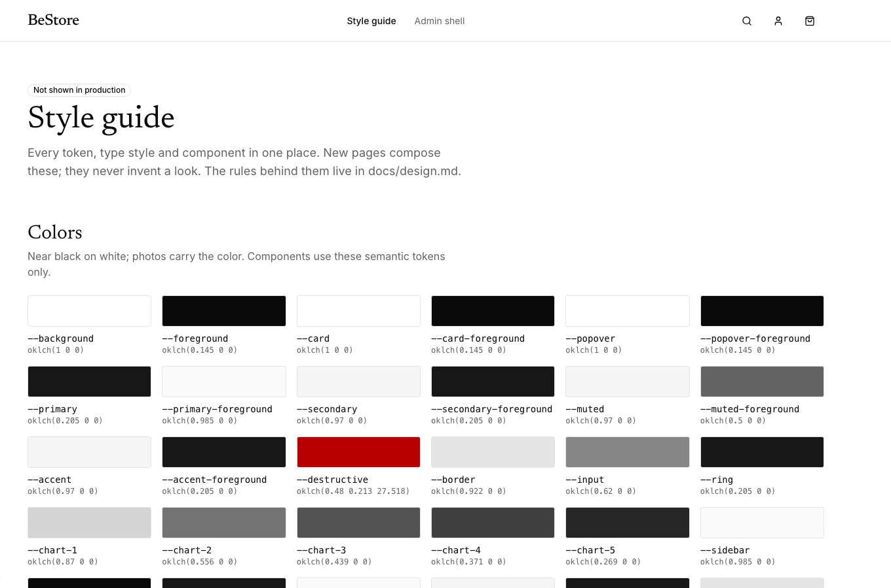
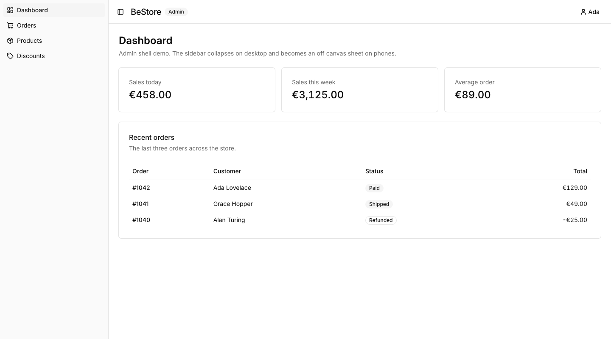

# BeStore

[](https://github.com/kris1027/BeStore/actions/workflows/ci.yml)

BeStore is a single-brand online store in one Next.js application: a storefront for customers and an admin panel for the team running it. The planned buying flow supports guest or account checkout and card payment. The project is under active development; it is not a live store.

## Current state

The application foundation, database model, shared design system, and admin sign-in with required TOTP are implemented. The storefront currently shows a coming-soon page. Product browsing and the core buy loop, card payment, shipping, catalog and order management, customer accounts, and launch work remain planned. The [scope](docs/scope/scope.md) is the source of truth for feature status and the [specifications](docs/specs/) explain completed decisions.

### Interface previews

These are screenshots of the **development style guides**, not a live storefront or sales dashboard. The admin preview contains sample orders and amounts.

| Storefront design system | Admin shell demo |
| --- | --- |
|  |  |

The design rules live in [docs/design.md](docs/design.md). The style guides are available locally at `/style-guide` and `/style-guide/admin`; they are not served in production.

## Local development

Use Node.js 24, the pnpm version pinned in [package.json](package.json), and a Docker-compatible container runtime for local Supabase. From the repository root:

```sh
pnpm install
cp .env.example .env.local
pnpm db:start
pnpm exec supabase status
```

Fill in `.env.local` using the committed [.env.example](.env.example) and the local Supabase URLs and keys from `supabase status`. Keep database connection strings, the service key, and the cart cookie secret private. Use a separate database for `TEST_DATABASE_URL`; database tests migrate and clear it. The [Supabase local-development guide](https://supabase.com/docs/guides/local-development/cli/getting-started) covers container setup.

Apply the local database migrations, optionally load the demo products, then start Next.js:

```sh
pnpm db:migrate
pnpm db:seed
pnpm dev
```

Open [localhost:3000](http://localhost:3000). The local seed is demo data; it does not create a live catalog. See the [admin account runbook](docs/runbooks/admin-accounts.md) to create an admin and test sign-in. Do not point seed or database-test commands at a production database.

## Checks

| Command | Purpose |
| --- | --- |
| `pnpm lint` | Check TypeScript and JavaScript lint rules. |
| `pnpm format:check` | Check formatting without writing files. |
| `pnpm typecheck` | Generate Next.js route types and check TypeScript. |
| `pnpm test` | Run unit and integration tests. |
| `pnpm test:db` | Run database tests against the separate `TEST_DATABASE_URL`. |
| `pnpm test:stack` | Run tests that need the local Supabase stack. |
| `pnpm test:e2e` | Run Playwright browser tests. |
| `pnpm build` | Build the production application. |

[CI](.github/workflows/ci.yml) runs lint, format, type checks, tests, and browser verification on pull requests. The local stack and environment variables are required for the database and browser suites.

## Project map

| Path | Purpose |
| --- | --- |
| [app/](app/) | Storefront, admin, auth, and style-guide routes. |
| [src/features/](src/features/) | Domain features and server operations. |
| [src/lib/](src/lib/) | Shared server and client utilities. |
| [prisma/](prisma/) | Database schema, migrations, and seed. |
| [supabase/](supabase/) | Local Supabase configuration. |
| [docs/](docs/) | Scope, specifications, design rules, and runbooks. |

This is a solo developer project supported by AI agents. Read [AGENTS.md](AGENTS.md) and the relevant spec before changing a feature. Work on a feature branch, report checks actually run, and merge through a pull request. The [bug and feature forms](https://github.com/kris1027/BeStore/issues/new/choose) keep work items concise; blank issues remain available for other tasks.
